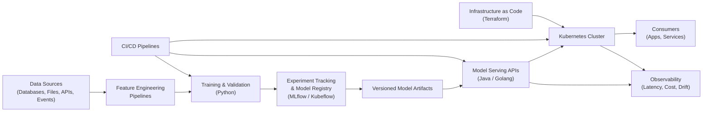

# 🚀 Enterprise AI Platform
**End-to-End MLOps + GenAI (Production-Grade Reference Architecture)**

[](https://opensource.org/licenses/MIT)
[](https://openjdk.org/)
[](https://www.python.org/)
[](https://golang.org/)
[](https://kubernetes.io/)

---

## 📋 Executive Summary

This repository demonstrates a **full-scale Enterprise AI Platform**, designed to reflect how modern companies build, deploy, operate, and evolve Machine Learning and Generative AI systems **in production**.

It goes far beyond notebooks and isolated models.  
The focus is on **architecture, reliability, observability, automation, and scale**.

This project is intended to clearly signal **real-world MLOps and AI platform experience** to senior engineers, architects, and recruiters within seconds.

---

## 👨‍💻 Author

<div align="center">

### **Adalberto Santos**

*Staff-Level Software Engineer | Event-Driven Architecture Specialist*

[](https://github.com/adeosantos)
[](https://linkedin.com/in/adalbertosantos)

</div>

---

## ✨ What This Project Shows (at a Glance)

- End-to-end **MLOps lifecycle**: training → validation → versioning → deployment
- **Production model serving** via REST and gRPC
- **GenAI integration** with LLMs, agents, and prompt versioning
- **Observability**: latency, cost, errors, and model/data drift
- **CI/CD** for both application code and ML models
- **Infrastructure as Code** using Terraform
- **Cloud-native architecture** using Docker and Kubernetes
- Clear separation of concerns between data, ML, serving, infra, and ops

---

## 🏗️ High-Level Architecture



---

## 🎯 Core Design Principles

- **Production-first**: everything assumes real traffic, failures, and evolution
- **Reproducibility**: models, data, infra, and deployments are versioned
- **Automation by default**: no manual steps to train or deploy
- **Language-agnostic serving**: ML in Python, APIs in Java/Golang
- **Cloud portability**: AWS/GCP–like architecture, runnable locally
- **Clear ownership boundaries**: ML, platform, and infra concerns are separated

---

## 🛠️ Tech Stack

### Languages
- **Python** — training pipelines, feature engineering, evaluation
- **Java** — high-performance model serving (enterprise APIs)
- **Golang** — lightweight, low-latency serving alternatives

### MLOps
- **MLflow** or **Kubeflow Pipelines**
- Experiment tracking
- Model registry with lifecycle stages (dev / staging / prod)

### Infrastructure
- **Docker** — containerization
- **Kubernetes** — orchestration, scaling, rollouts
- **Terraform** — declarative infrastructure

### CI/CD
- Automated training and validation
- Model promotion gates
- Blue/green and canary deployments
- Rollbacks on regression

### Observability
- API latency and throughput
- Inference cost estimation
- Error rates
- Data and model drift detection

### GenAI
- LLM adapters
- Prompt versioning
- Agent-based multi-step workflows
- Cost and latency guardrails

---

## 📂 Repository Structure

```
enterprise-ai-platform/
├── README.md
├── LICENSE
├── .gitignore
├── build.gradle.kts              # Gradle build configuration
├── settings.gradle.kts           # Gradle settings
│
├── data/                         # Data management
│   ├── raw/                      # Raw data ingestion
│   │   ├── external/             # External data sources
│   │   └── internal/             # Internal data sources
│   ├── processed/                # Cleaned and transformed data
│   │   ├── cleaned/              # Cleaned datasets
│   │   └── normalized/           # Normalized datasets
│   ├── features/                 # Feature store outputs
│   │   ├── offline/              # Offline features for training
│   │   └── online/               # Online features for serving
│   └── samples/                  # Sample datasets for testing
│       └── sample_dataset.csv
│
├── training/                     # ML training lifecycle
│   ├── pipelines/                # Training orchestration
│   │   ├── train.py              # Main training pipeline
│   │   ├── validate.py           # Model validation
│   │   ├── promote.py            # Model promotion
│   │   └── retrain_trigger.py   # Automated retraining logic
│   ├── feature_engineering/      # Feature transformations
│   │   ├── transformations.py    # Feature transformations
│   │   └── validators.py         # Feature validation
│   ├── evaluation/               # Model evaluation metrics
│   │   ├── metrics.py            # Evaluation metrics
│   │   └── thresholds.yaml       # Quality thresholds
│   ├── experiments/              # Experiment tracking (MLflow)
│   │   └── experiment_runner.py
│   ├── config/                   # Training configuration
│   │   └── training.yaml
│   └── tests/                    # Training tests
│       └── test_training_pipeline.py
│
├── models/                       # Model management
│   ├── registry/                 # Model version registry
│   │   └── mlflow_registry.py
│   ├── artifacts/                # Serialized model files
│   │   ├── model.pkl
│   │   └── model.onnx
│   ├── schemas/                  # Input/output schemas
│   │   └── input_output_schema.json
│   └── metadata/                 # Model documentation
│       └── model_card.md
│
├── serving/                      # Production inference APIs
│   ├── api-java/                 # Java-based serving (Spring Boot)
│   │   ├── src/main/java/        # Java source code
│   │   │   └── com/company/ai/
│   │   │       ├── Application.java
│   │   │       ├── controller/
│   │   │       ├── service/
│   │   │       ├── model/
│   │   │       └── config/
│   │   ├── src/main/resources/   # Application resources
│   │   │   └── application.yml
│   │   ├── Dockerfile
│   │   ├── pom.xml               # Maven configuration
│   │   └── README.md
│   ├── api-golang/               # Go-based serving (high performance)
│   │   ├── cmd/server/           # Application entry point
│   │   │   └── main.go
│   │   ├── internal/             # Internal packages
│   │   │   ├── handler/
│   │   │   ├── service/
│   │   │   ├── model/
│   │   │   └── registry/
│   │   ├── Dockerfile
│   │   ├── go.mod                # Go module definition
│   │   └── README.md
│   └── protos/                   # gRPC service definitions
│       └── inference.proto
│
├── genai/                        # Generative AI components
│   ├── llm-adapters/             # Provider abstractions
│   │   ├── openai_adapter.py
│   │   └── local_llm_adapter.py
│   ├── prompt-engineering/       # Versioned prompts
│   │   ├── templates/
│   │   │   └── base_prompt.txt
│   │   ├── versions/
│   │   │   └── v1.yaml
│   │   └── evaluator.py
│   ├── agents/                   # Multi-step AI agents
│   │   ├── orchestrator.py
│   │   └── tools.py
│   ├── evaluations/              # GenAI quality metrics
│   │   ├── metrics.py
│   │   └── test_cases.json
│   └── config/
│       └── genai.yaml
│
├── observability/                # Production monitoring
│   ├── metrics/                  # Custom metrics (Prometheus)
│   │   ├── prometheus_rules.yaml
│   │   └── exporter.py
│   ├── tracing/                  # Distributed tracing (Jaeger/Tempo)
│   │   └── otel_config.yaml
│   ├── logging/                  # Structured logging
│   │   └── log_config.yaml
│   ├── drift-detection/          # Data and model drift
│   │   ├── data_drift.py
│   │   └── model_drift.py
│   └── cost-monitoring/          # Inference cost tracking
│       └── cost_estimator.py
│
├── infra/                        # Infrastructure as Code
│   ├── terraform/                # Cloud infrastructure
│   │   ├── modules/              # Reusable modules
│   │   │   ├── kubernetes/
│   │   │   ├── registry/
│   │   │   └── networking/
│   │   ├── envs/                 # Environment configs
│   │   │   ├── dev/
│   │   │   ├── staging/
│   │   │   └── prod/
│   │   ├── main.tf
│   │   └── README.md
│   ├── kubernetes/               # K8s manifests
│   │   ├── base/                 # Base configurations
│   │   │   ├── deployment.yaml
│   │   │   └── service.yaml
│   │   └── overlays/             # Environment overlays (Kustomize)
│   │       ├── dev/
│   │       ├── staging/
│   │       └── prod/
│   └── helm/                     # Helm charts
│       └── ai-platform-chart/
│
├── ci-cd/                        # CI/CD pipelines
│   ├── model-pipeline/           # ML pipeline automation
│   │   ├── train.yml
│   │   ├── validate.yml
│   │   └── deploy.yml
│   └── application-pipeline/     # Application deployment
│       ├── build.yml
│       ├── test.yml
│       └── release.yml
│
├── scripts/                      # Utility scripts
│   ├── bootstrap.sh              # Environment setup
│   ├── local_cluster.sh          # Local K8s cluster (kind/minikube)
│   └── cleanup.sh                # Resource cleanup
│
├── docs/                         # Documentation
│   ├── architecture.md           # System architecture
│   ├── mlops_flow.md             # MLOps workflow
│   ├── genai_design.md           # GenAI patterns
│   └── adr/                      # ADRs (Architecture Decision Records)
│       └── 0001-platform-decisions.md
│
└── examples/                     # Usage examples
    ├── notebooks/                # Jupyter notebooks
    │   └── exploration.ipynb
    └── api-usage/                # API client examples
        └── curl_examples.sh
```

Each folder maps directly to a **real enterprise responsibility**.

---

## 🔄 Model Lifecycle (End-to-End)

1. **Data ingestion**
2. **Feature engineering**
3. **Model training**
4. **Validation & quality gates**
5. **Experiment tracking**
6. **Model registration**
7. **Automated promotion**
8. **Deployment to Kubernetes**
9. **Live inference via API**
10. **Monitoring & drift detection**
11. **Automated retraining triggers**

This reflects how AI systems are actually operated over time.

---

## 🚀 Model Serving Strategy

- Models are **not embedded** directly in applications
- APIs load models dynamically from a registry
- Supports:
    - REST for general consumers
    - gRPC for high-performance internal calls
- Independent scaling of:
    - Training workloads
    - Serving workloads

---

## 🤖 GenAI Capabilities

This platform treats GenAI as a **first-class production system**, not a demo.

Included concepts:
- Prompt templates with versioning
- LLM provider abstraction
- Multi-step agent workflows
- Latency and token cost tracking
- Safe rollout of prompt changes

This mirrors how enterprises integrate LLMs responsibly.

---

## ⚙️ CI/CD Flow

**Model pipeline**
- Triggered by data or code changes
- Trains and validates models
- Automatically registers new versions
- Promotes only if metrics pass thresholds

**Application pipeline**
- Builds serving APIs
- Runs tests
- Produces container images
- Deploys via Kubernetes manifests or Helm

---

## 💻 Getting Started

### Prerequisites

- **Docker** 24.0+
- **Kubernetes** (minikube, kind, or Docker Desktop)
- **Java** 17+
- **Python** 3.10+
- **Go** 1.21+
- **Terraform** 1.5+
- **Gradle** 8.0+

### Quick Start

1. **Clone the repository**
   ```bash
   git clone https://github.com/yourusername/enterprise-ai-platform.git
   cd enterprise-ai-platform
   ```

2. **Bootstrap the environment**
   ```bash
   ./scripts/bootstrap.sh
   ```

3. **Start local Kubernetes cluster**
   ```bash
   ./scripts/local_cluster.sh
   ```

4. **Build the Java project**
   ```bash
   ./gradlew build
   ```

5. **Install Python dependencies**
   ```bash
   pip install -r requirements.txt
   ```

6. **Run training pipeline**
   ```bash
   python training/pipelines/train.py
   ```

7. **Deploy serving APIs**
   ```bash
   # Java API
   cd serving/api-java
   mvn clean package
   docker build -t ai-platform/java-api:latest .
   kubectl apply -f ../../infra/kubernetes/base/deployment.yaml
   kubectl apply -f ../../infra/kubernetes/base/service.yaml

   # Go API
   cd ../api-golang
   go build -o server cmd/server/main.go
   docker build -t ai-platform/go-api:latest .
   ```

8. **Test the APIs**
   ```bash
   # Wait for pods to be ready
   kubectl wait --for=condition=ready pod -l app=ai-inference --timeout=60s
   
   # Forward port to access API
   kubectl port-forward svc/ai-inference-api 8080:80
   
   # Run test requests
   ./examples/api-usage/curl_examples.sh
   ```

### Local Development

The platform is designed to run **locally** with:
- Local Kubernetes cluster (kind/minikube)
- Simulated cloud services
- Reproducible environments via Docker Compose
- Port-forwarded APIs for testing

This allows safe experimentation without cloud cost.

---

## 🎓 Key Learning Outcomes

This project demonstrates proficiency in:

- **MLOps Engineering**: End-to-end ML lifecycle management
- **Polyglot Development**: Python, Java, and Go in production
- **Cloud-Native Architecture**: Kubernetes, Docker, microservices
- **Infrastructure as Code**: Terraform, Helm, Kustomize
- **CI/CD Automation**: GitHub Actions, automated deployments
- **Production Observability**: Metrics, logging, tracing, alerting
- **GenAI Integration**: LLM APIs, agents, prompt management
- **API Design**: REST and gRPC services
- **System Design**: Scalability, reliability, maintainability

---

## 💡 Why This Project Is High Impact

- Shows **systems thinking**, not just ML skills
- Demonstrates **real MLOps maturity**
- Combines backend, infra, and AI
- Matches how FAANG and large enterprises operate AI platforms
- Recruiters can assess seniority in under 30 seconds

This is the difference between *“knows ML”* and *“builds AI platforms”*.

---

## 🎯 Intended Audience

- Senior / Staff Software Engineers
- AI Engineers beyond notebooks
- Backend / Platform engineers moving into AI
- Tech Leads and Architects
- Recruiters hiring for production AI roles

---

## 🗺️ Roadmap

- [ ] Add MLflow integration for experiment tracking
- [ ] Implement Kubeflow Pipelines for orchestration
- [ ] Add data drift detection with Evidently
- [ ] Integrate Prometheus and Grafana dashboards
- [ ] Add A/B testing framework for models
- [ ] Implement feature store (Feast)
- [ ] Add real-time streaming inference (Kafka + Flink)
- [ ] Deploy to AWS/GCP with Terraform
- [ ] Add model explainability (SHAP, LIME)
- [ ] Implement automated model retraining

---

## 🤝 Contributing

Contributions are welcome! This is a learning and portfolio project.

1. Fork the repository
2. Create your feature branch (`git checkout -b feature/AmazingFeature`)
3. Commit your changes (`git commit -m 'Add some AmazingFeature'`)
4. Push to the branch (`git push origin feature/AmazingFeature`)
5. Open a Pull Request

---

## 📚 Additional Resources

- [MLOps Principles](https://ml-ops.org/)
- [Kubernetes Documentation](https://kubernetes.io/docs/)
- [Terraform Best Practices](https://www.terraform-best-practices.com/)
- [GenAI Design Patterns](docs/genai_design.md)
- [Architecture Decision Records](docs/adr/)

---

## 📧 Contact

**Adalberto Santos**
- GitHub: [@yourusername](https://github.com/yourusername)
- LinkedIn: [Your Profile](https://linkedin.com/in/yourprofile)
- Email: your.email@example.com

---

## ⚠️ Disclaimer

This project is a **reference implementation** for learning and portfolio purposes.
It simulates enterprise systems without exposing proprietary data or infrastructure.

---

## 📄 License

This project is licensed under the MIT License - see the [LICENSE](LICENSE) file for details.

---

## ⭐ Show Your Support

If you find this project helpful, please give it a star! ⭐

---

**Built with ❤️ to demonstrate production-grade AI platform engineering**